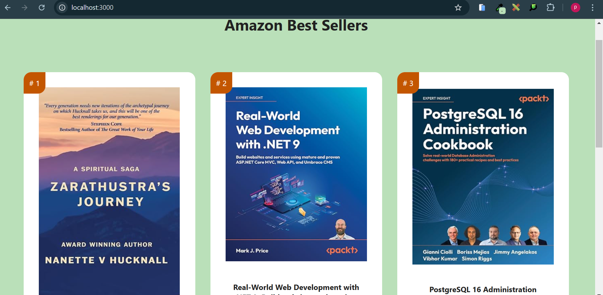

# Components and props



## Components

- **Definition**: Components are the building blocks of a React application. They are self-contained pieces of UI that can be reused throughout your application.
- **Types**:
  - **Function Components**: These are simpler and are defined as JavaScript functions. They take props as an argument and return React elements.
  - **Class Components**: These are ES6 classes that extend from React.Component. They have more features like lifecycle methods and local state.
- **Usage**: Components allow you to split the UI into independent, reusable pieces, and think about each piece in isolation.
---

## Props
- **Definition**: Props (short for properties) are inputs to a React component. They are data passed down from a parent component to a child component.
- **Purpose**: Props allow you to pass data and event handlers to child components, making them dynamic and reusable.
- **Immutability**: Props are read-only. A component cannot change its props; it can only read them and render based on their values.
--- 

### Example

```java
// Function Component
function Welcome(props) {
  return <h1>Hello, {props.name}</h1>;
}

// Usage of the Welcome component with props
function App() {
  return (
    <div>
      <Welcome name="Pitou" />
      <Welcome name="Tchotcho" />
    </div>
  );
}

```

In this example:

- ``Welcome`` is a function component that takes props as an argument.
- ``props.name`` is used to display a personalized greeting.
- ``The App component`` renders the Welcome component twice with different name props.

## Key Points
- **Reusability**: Components promote code reuse, making your application easier to maintain and scale.
- **Modularity**: By breaking down the UI into smaller components, you can manage and test each part independently.
- **Data Flow**: Props facilitate a unidirectional data flow from parent to child components, making the data flow predictable and easier to understand.


## Challenge

## Visual of the project


## The Amazon Best Sellers

In this project, we will cover various interesting React topics, such as:
- Adding and managing CSS styles.
- Handling images effectively in React.
- Understanding and using props to pass data between components.

### Goal

Our goal is to replicate a feature inspired by the Amazon Best Sellers page. We will focus on building a clean and responsive home page that lists top-selling books.

---

## Features

- **Dynamic Book List**: A list of books that displays their title, author, and position in the ranking.
- **Responsive Design**: The layout is optimized for different screen sizes using CSS grid.
- **Reusable Components**: Breaking the UI into smaller, reusable components like `Book` and `BookList`.

---

## Technologies Used

- **React**: For building the user interface.
- **CSS**: For styling the application.
- **JSX**: To create a structured component-based architecture.

---